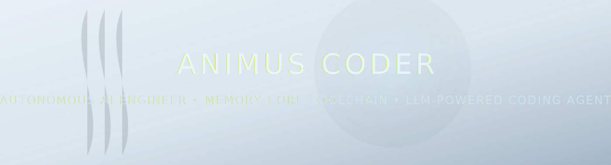

# ❄️ ANIMUS MEMORY CORE — SUPPORT CHANNELS

<p align="center">
  
</p>


The **Animus Coder** project is developed as an independent, open-source
AI engineering ecosystem — focused on autonomous coding agents,
secure toolchains, high-performance reasoning, and advanced LLM integrations.

Your support directly strengthens the **Animus Memory Core**,
expands research, and accelerates new capabilities.

---

## 🧬 Why Support the Project?

Funds are used for:

* GPU compute for model benchmarking
* Research in agent planning & tool-calling reliability
* Development of secure sandbox execution
* Performance optimization for local LLMs
* Building advanced debugging, reasoning & patch-cycle systems
* Maintaining infrastructure for releases & CI
* Expanding the Animus open-source ecosystem

Animus Coder is — and will remain — **fully open-source, private, and local-first**.
Your contribution helps it grow stronger.

---

## ❄️ Memory Transfer Channels (Crypto)

Below are direct channels for supporting the Animus Core.
Choose any format you prefer:

### **USDT (ERC20)**

```
0xc85f2d1c4393d69c9f05261662e90a214387bda1
```

### **ETH (COIN)**

```
0xc85f2d1c4393d69c9f05261662e90a214387bda1
```

### **BTC**

```
bc1q64hm6hjy6kmm0jrdhkdd48h7jwl2lzwy7rhrrz
```

### **SOL (Solana)**

```
6C7fp86bMbts9FGeDm4ZMwuEMeosEHQMy12XeNX7vVNu
```

### **XRP (XRP, No tag required)**

```
rMAemXcrYbrhnZB1yRQEvZJNTGAwKtzbpz
```

## 🌌 Closing Note

> *Every transfer strengthens the neural lattice.*
> *Every contribution fuels autonomous intelligence.*
> *Every supporter becomes part of the Animus Network.*

Thank you for empowering **Animus Coder** —
your support drives the evolution of open, private, sovereign AI engineering.